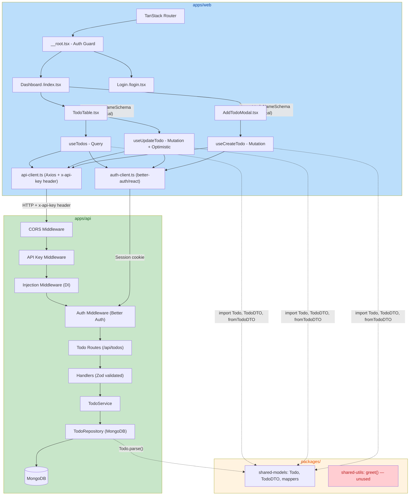
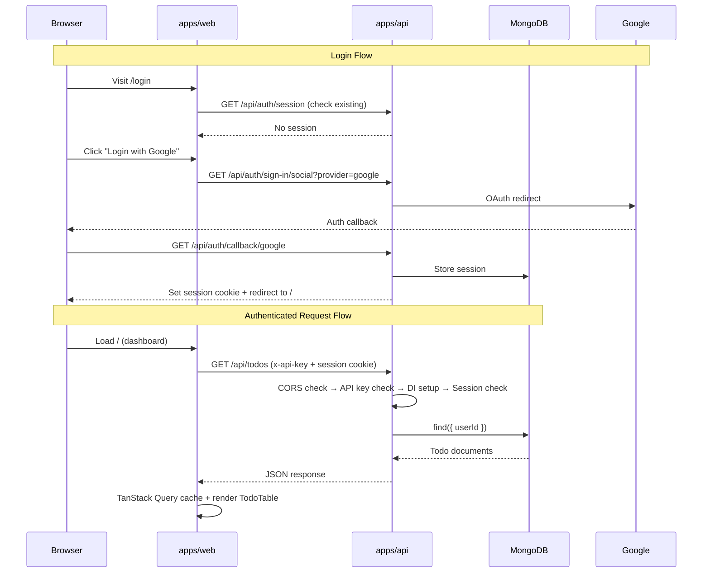

# Code Review — Fullstack Turbo Pack Template

> **Review Date:** 2026-06-30  
> **Review Focus:** Code Quality & Best Practices  
> **Project Stage:** Template / Starter Kit  
> **Goal:** Solid code conventions, CRUD-based todo as reference implementation, test safety net

---

## Architecture Overview

Monorepo (Turborepo + pnpm workspaces) with three packages:

| Package | Stack | Purpose |
|---------|-------|---------|
| `apps/api` | Hono + Bun + MongoDB (native driver) + Better Auth | REST API with dual auth (API key + Google OAuth session) |
| `apps/web` | React 18 + Vite + TanStack Router + TanStack Query + shadcn/ui + Tailwind + Axios | SPA with protected routes, todo CRUD dashboard |
| `packages/shared-models` | Zod schemas + DTO mappers | Shared type definitions and data transformation |

### Architecture Diagram



### Auth Flow



---

## Issue Summary

| # | Severity | Title | Location |
|---|----------|-------|----------|
| 1 | Critical | No ownership check on `getTodoByIdHandler` — IDOR vulnerability | [get-todo-by-id-handler.ts:9-11](file:///apps/api/src/handlers/todo/get-todo-by-id-handler.ts#L9-L11) |
| 2 | Critical | DB connection failure is silently swallowed — no `.catch()` | [index.ts:14-52](file:///apps/api/src/index.ts#L14-L52) |
| 3 | Critical | `getDB()` throws if DB not ready — unhandled crash on first request | [injection-middleware.ts:9](file:///apps/api/src/middlewares/injection-middleware.ts#L9) |
| 4 | High | `getInt()` returns `NaN` for `undefined` env vars — type check passes | [config/index.ts:13-20](file:///apps/web/src/config/index.ts#L13-L20) |
| 5 | High | API response contract mismatch — backend returns raw dates, frontend converts | [todo-repository.ts:18-51](file:///apps/api/src/repositories/todo-repository.ts#L18-L51) |
| 6 | High | No tests anywhere in the monorepo | Entire codebase |
| 7 | Medium | Filename contains a space: `get- todos-handler.ts` | [get- todos-handler.ts](file:///apps/api/src/handlers/todo/get- todos-handler.ts) |
| 8 | Medium | `@repo/shared-utils` is dead code — only unused `greet()` | [shared-utils/src/index.ts](file:///packages/shared-utils/src/index.ts) |
| 9 | Medium | Empty `z.object({})` validator on GET /todos — unnecessary overhead | [get- todos-handler.ts:3](file:///apps/api/src/handlers/todo/get- todos-handler.ts#L3) |
| 10 | Medium | `updateTodo` accepts `Record<string, unknown>` — no type safety | [todo-repository.ts:46](file:///apps/api/src/repositories/todo-repository.ts#L46) |
| 11 | Low | Mutations fail silently — no error toasts for users | [useCreateTodo.ts](file:///apps/web/src/hooks/useCreateTodo.ts), [useUpdateTodo.ts](file:///apps/web/src/hooks/useUpdateTodo.ts) |
| 12 | Low | Both auth middlewares return identical `{ error: 'Unauthorized' }` — ambiguous | [api-key-middleware.ts:11](file:///apps/api/src/middlewares/api-key-middleware.ts#L11), [auth-middleware.ts:22](file:///apps/api/src/middlewares/auth-middleware.ts#L22) |
| 13 | Low | Frontend `todo-schema.ts` duplicates shared `Todo` validation | [todo-schema.ts](file:///apps/web/src/schemas/todo-schema.ts) |
| 14 | Low | Inconsistent text casing: `"no todo yet"` vs rest of UI | [TodoTable.tsx:54](file:///apps/web/src/components/TodoTable.tsx#L54) |

---

## Detailed Findings

### 1. [Critical] IDOR in `getTodoByIdHandler` — Missing Ownership Check

**File:** [apps/api/src/handlers/todo/get-todo-by-id-handler.ts](file:///apps/api/src/handlers/todo/get-todo-by-id-handler.ts)

```typescript
// Current: no ownership check
export const getTodoByIdHandler = async (c: Context) => {
  const todoService = c.get('todoService');
  const id = c.req.param('id');
  const todo = await todoService.getTodoById(id);
  return c.json(todo);
};
```

Compare with `updateTodoHandler` which correctly checks ownership:

```typescript
// updateTodoHandler has it:
const existing = await todoService.getTodoById(id);
if (!existing || existing.userId !== userId) {
  return c.json({ error: 'Todo not found' }, 404);
}
```

**Impact:** Any authenticated user can read any other user's todos by guessing/iterating object IDs. This is a textbook Insecure Direct Object Reference (IDOR).

**Fix:** Add the same ownership check pattern used in `updateTodoHandler`:

```typescript
const userId = c.get('user').id;
const todo = await todoService.getTodoById(id);
if (!todo || todo.userId !== userId) {
  return c.json({ error: 'Todo not found' }, 404);
}
return c.json(todo);
```

---

### 2. [Critical] Unhandled Database Connection Failure

**File:** [apps/api/src/index.ts](file:///apps/api/src/index.ts#L14-L52)

```typescript
connectDB().then(({ db, client }) => {
  // ... all route setup inside .then()
});  // No .catch()!
```

If MongoDB is unreachable, the server starts successfully but no routes are mounted. Every request gets a 404 with no indication of what went wrong. In production this would be a silent outage.

**Fix:**

```typescript
connectDB()
  .then(({ db, client }) => {
    // ... route setup
  })
  .catch((err) => {
    console.error('Failed to connect to MongoDB:', err);
    process.exit(1);
  });
```

Or better, use a startup health check that blocks the server from accepting traffic until DB is ready.

---

### 3. [Critical] `getDB()` Crash on First Request During Startup

**File:** [apps/api/src/middlewares/injection-middleware.ts](file:///apps/api/src/middlewares/injection-middleware.ts#L9)

```typescript
const injectMiddleware = createMiddleware(async (c, next) => {
  const db = getDB();  // throws if DB not connected yet
  // ...
});
```

```typescript
// getDB in mongo-db.ts:
export const getDB = () => {
  if (!db) throw new Error('MongoDB not connected');  // unhandled throw
  return db;
};
```

There is a race condition window where the server is accepting requests but the DB promise hasn't resolved. The thrown error propagates as an unhandled 500, which Hono may expose with a stack trace.

**Fix:** Return a proper error response instead of throwing:

```typescript
const db = getDB();
if (!db) {
  return c.json({ error: 'Service unavailable' }, 503);
}
```

---

### 4. [High] `getInt()` Silent `NaN` Bug in Frontend Config

**File:** [apps/web/src/config/index.ts](file:///apps/web/src/config/index.ts#L13-L20)

```typescript
const getInt = (key: string) => {
  const value = Number.parseInt(ENV[key] as string, 10);
  if (typeof value === 'number') {
    return value;
  }
  throw new Error(`VITE_${key} is not a number`);
};
```

`Number.parseInt(undefined, 10)` returns `NaN`, and `typeof NaN === 'number'` is `true`. So if `VITE_` env vars are missing, this silently returns `NaN` instead of throwing. Currently there are no integer env vars used on the web side, but this bug will bite future users who add one.

**Fix:**

```typescript
const getInt = (key: string) => {
  const raw = ENV[key];
  if (typeof raw !== 'string') {
    throw new Error(`VITE_${key} is not a string`);
  }
  const value = Number.parseInt(raw, 10);
  if (Number.isNaN(value)) {
    throw new Error(`VITE_${key} is not a valid integer`);
  }
  return value;
};
```

Note: The same bug exists in [apps/api/src/config/index.ts](file:///apps/api/src/config/index.ts#L11-L16) — though there `getInt` is actually used for `PORT`, making it critical on the API side too.

---

### 5. [High] API Response Contract Mismatch

**File:** [apps/api/src/repositories/todo-repository.ts](file:///apps/api/src/repositories/todo-repository.ts#L18-L51)

The backend returns raw MongoDB documents with `Date` objects for `createdAt`/`updatedAt`. But the `@repo/shared-models` package defines `TodoDTO` with `z.string()` dates and provides `toTodoDTO()` / `fromTodoDTO()` mappers. The backend never calls `toTodoDTO()`.

The frontend manually converts:
```typescript
// useTodos.ts
const parsed = z.array(TodoDTO).parse(res.data.todos);
return parsed.map(fromTodoDTO);
```

This means:
- The API contract is not self-documenting (no `TodoDTO` in responses)
- If another client (mobile, CLI) consumes this API, they must duplicate the conversion logic
- The shared models package is only half-used

**Fix:** Convert to DTO in the repository or service layer before returning from handlers:

```typescript
// In todo-repository.ts, use the mapper:
import { toTodoDTO } from '@repo/shared-models';

async getTodos(userId: string): Promise<TodoDTO[]> {
  const docs = await this.collection.find({ userId }).toArray();
  return docs.map(doc => toTodoDTO(this.parseDoc(doc)));
}
```

---

### 6. [High] No Tests

There are zero test files in the entire monorepo (`**/*.test.{ts,tsx}` glob returns nothing). For a template meant to establish conventions, example tests are essential.

**Recommendation:** Add at minimum:
- **`apps/api`**: Unit tests for `TodoRepository` with an in-memory MongoDB (mongodb-memory-server), integration tests for the `/api/todos` endpoints via Hono's test client
- **`apps/web`**: Component tests for `TodoTable`, `AddTodoModal` using Vitest + Testing Library
- **`packages/shared-models`**: Unit tests for `Todo`/`TodoDTO` schema validation and mapper functions

---

### 7. [Medium] Filename Contains a Space

**File:** [apps/api/src/handlers/todo/get- todos-handler.ts](file:///apps/api/src/handlers/todo/get- todos-handler.ts)

The filename `get- todos-handler.ts` has a space between `get-` and `todos`. This can cause issues on CI systems, shell scripts, and is generally confusing.

**Fix:** Rename to `get-todos-handler.ts`.

---

### 8. [Medium] Dead Code: `@repo/shared-utils`

**File:** [packages/shared-utils/src/index.ts](file:///packages/shared-utils/src/index.ts)

```typescript
export function greet(name: string) {
  return `Hello, ${name}!`;
}
```

This package exports only `greet()`, which is never imported anywhere. However, it's listed as a dependency in `apps/web/package.json`. This adds unnecessary install time and suggests an incomplete package.

**Options:**
- Remove the package and `@repo/shared-utils` dependency from `apps/web` if it's not needed
- Or: populate it with genuinely useful shared utilities (e.g., `cn()` function, date formatters, type guards)

---

### 9. [Medium] Empty Zod Validator on GET Route

**File:** [apps/api/src/handlers/todo/get- todos-handler.ts](file:///apps/api/src/handlers/todo/get- todos-handler.ts#L3)

```typescript
export const getTodosQuerySchema = z.object({});  // empty object
```

Applied as middleware: `zValidator('query', getTodosQuerySchema)`. Since there are no query parameters to validate, this adds middleware overhead with no benefit. It also sets a misleading pattern for future developers.

**Fix:** Remove the validator from the route and the empty schema export:

```typescript
// In routes:
router.get('/', getTodoHandler);  // without zValidator

// Remove getTodosQuerySchema export from handlers/todo/index.ts
```

---

### 10. [Medium] Unsafe `Record<string, unknown>` in `updateTodo`

**File:** [apps/api/src/repositories/todo-repository.ts](file:///apps/api/src/repositories/todo-repository.ts#L46)

```typescript
async updateTodo(id: string, fields: Record<string, unknown>, userId?: string) {
  // ...
  { $set: { ...fields, updatedAt: new Date() } },
}
```

The `fields` parameter accepts any key-value pair. If the Zod validation on the handler is somehow bypassed (or if a future developer removes it), arbitrary fields can be injected into MongoDB documents (e.g., `{ "$set": { "role": "admin" } }`).

**Fix:** Use the DTO schema type instead:

```typescript
import type { UpdateTodoDTO } from '@repo/shared-models';

// Define in shared-models:
export const UpdateTodoDTO = z.object({
  name: z.string().min(1).optional(),
  status: z.enum(['pending', 'done']).optional(),
});
export type UpdateTodoDTO = z.infer<typeof UpdateTodoDTO>;

// Use in repository:
async updateTodo(id: string, fields: UpdateTodoDTO, userId?: string) {
```

---

### 11. [Low] Silent Mutation Failures — No User Feedback

**Files:** [useCreateTodo.ts](file:///apps/web/src/hooks/useCreateTodo.ts), [useUpdateTodo.ts](file:///apps/web/src/hooks/useUpdateTodo.ts)

```typescript
// useCreateTodo.ts — no onError
return useMutation({
  mutationFn: createTodo,
  onSuccess: () => {
    queryClient.invalidateQueries({ queryKey: ['todos', userId] });
  },
  // Missing: onError
});
```

If the API returns 401/500, the user sees no feedback. The optimistic update in `useUpdateTodo` correctly rolls back, but the user doesn't know something went wrong.

**Fix:** Add error toasts with `sonner` (already installed):

```typescript
import { toast } from 'sonner';

onError: (error) => {
  toast.error('Failed to create todo. Please try again.');
},
```

---

### 12. [Low] Ambiguous 401 Error Messages

**Files:** [api-key-middleware.ts:11](file:///apps/api/src/middlewares/api-key-middleware.ts#L11), [auth-middleware.ts:22](file:///apps/api/src/middlewares/auth-middleware.ts#L22)

Both middlewares return identical `{ error: 'Unauthorized' }` with 401 status. When the API key is wrong vs. the session is expired, the client can't distinguish them. This makes debugging harder for developers using the template.

**Fix:** Differentiate the messages:

```typescript
// api-key-middleware.ts
return c.json({ error: 'Invalid or missing API key' }, 401);

// auth-middleware.ts
return c.json({ error: 'Invalid or expired session' }, 401);
```

---

### 13. [Low] Duplicated Validation Schema

**File:** [apps/web/src/schemas/todo-schema.ts](file:///apps/web/src/schemas/todo-schema.ts)

```typescript
export const todoNameSchema = z.object({
  name: z.string().min(1, 'Todo name is required'),
});
```

This duplicates `Todo.shape.name` from `@repo/shared-models`. If the name validation changes in the shared model (e.g., max length), the frontend schema silently diverges.

**Fix:** Derive from the shared model:

```typescript
import { Todo } from '@repo/shared-models';

export const todoNameSchema = Todo.pick({ name: true });
export type TodoNameForm = z.infer<typeof todoNameSchema>;
```

---

### 14. [Low] Inconsistent Text Casing in Empty State

**File:** [apps/web/src/components/TodoTable.tsx](file:///apps/web/src/components/TodoTable.tsx#L54)

```tsx
<p className="text-lg text-muted-foreground">no todo yet</p>
```

All other UI text uses sentence case or title case. This is lowercase. Minor consistency issue.

**Fix:** `"No todos yet"` or `"No todos yet. Add your first one!"`

---

## Recommendations Beyond Issues

### 1. Add a Global Error Handler in Hono

The backend has no `app.onError()` handler. Unhandled exceptions expose internal details:

```typescript
app.onError((err, c) => {
  console.error('Unhandled error:', err);
  return c.json({ error: 'Internal server error' }, 500);
});
```

### 2. Define `UpdateTodoDTO` in Shared Models

Currently `updateTodo` accepts `Record<string, unknown>`. Define a typed update DTO in `@repo/shared-models` and use it end-to-end (handler validation → service → repository).

### 3. Add `pnpm-workspace.yaml` Config Review

**File:** [pnpm-workspace.yaml](file:///pnpm-workspace.yaml)

The current workspaces are `apps/*` and `packages/*`. For a production template, consider adding `catalog:` for shared dependency versions to prevent version drift between apps.

### 4. TypeScript Strict Mode

Check individual `tsconfig.json` files — ensure `"strict": true` is enabled in all packages. Currently `apps/web/tsconfig.json` and `apps/api/tsconfig.json` should be reviewed.

### 5. Environment Variable Validation at Startup

Both `apps/api/src/config/index.ts` and `apps/web/src/config/index.ts` validate env vars lazily (on first access). Prefer fail-fast: validate all required env vars at startup so misconfiguration is caught immediately, not on the first request that needs the missing value.

---

## Summary

| Category | Count |
|----------|-------|
| Critical | 3 |
| High | 3 |
| Medium | 4 |
| Low | 4 |
| **Total Issues** | **14** |

**What's Working Well:**
- Clean monorepo structure with Turborepo + pnpm workspaces
- Good separation of concerns: handlers → service → repository
- Proper use of dependency injection middleware in Hono
- Optimistic updates in `useUpdateTodo` with proper rollback on error
- TanStack Router with typed route tree generation
- shadcn/ui components are well-structured and follow Radix patterns
- Better Auth integration is clean and follows the library's patterns
- Zod validation on both API routes and frontend forms
- Biome for formatting + linting (fast, modern alternative to ESLint/Prettier)

**What Needs Immediate Attention (Critical):**
1. IDOR vulnerability in `getTodoByIdHandler` — add ownership check
2. DB connection failure handling — add `.catch()` and graceful shutdown
3. `getDB()` crash — return 503 instead of throwing
